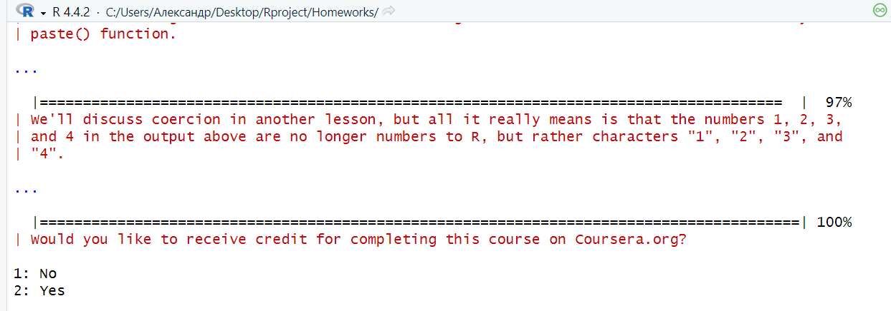

# Лабораторная работа №1. Введение в R
a.nikitchik@yandex.ru

# Введение в R

## Цель работы

1.  Развить практические навыки использования языка программирования R
    для обработки данных
2.  Развить навыки работы в Rstudio IDE: установка пакетов работа с
    проектами в Rstudio настройка и работа с Git
3.  Закрепить знания базовых типов данных языка R и простейших операций
    с ними

## Исходные данные

1.  Программное обеспечение Windows 11
2.  Rstudio Desktop
3.  Интерпретатор языка R 4.4.2

## Ход работы

1.  Установить программный пакет swirl: через интерфейс Rstudio IDE или
    функцией R install.packages(“swirl”)

    

2.  Запустить задание с помощью swirl::swirl()

    ‘swirl::swirl()’

    

3.  Выбрать из меню курсов 1. R Programming: The basics of programming
    in R

    

4.  Запустить подкурсы и выполнить:

    1.  Базовые структурные блоки (Basic Building Blocks)

        

    2.  Рабочие пространства и файлы (Workspace and Files)

        

    3.  Последовательности чисел (Sequences of Numbers)

        

    4.  Векторы (Vectors)

        

    5.  Пропущенные значения (Missing Values)

        

5.  Составить отчет и выложить его и исходный qmd/rmd файл в свой
    репозиторий

## Оценка результата

В результате лабораторной работы была скачана библиотека swirl и освоены
первые 5 тем курса “R Programming: The basics of programming in R”.

## Вывод

Таким образом, мы усвоили основы библиотеки swirl и разобрали базовые
структурные блоки, рабочие пространства и файлы, последовательности,
векторы и пропущенные значения.
