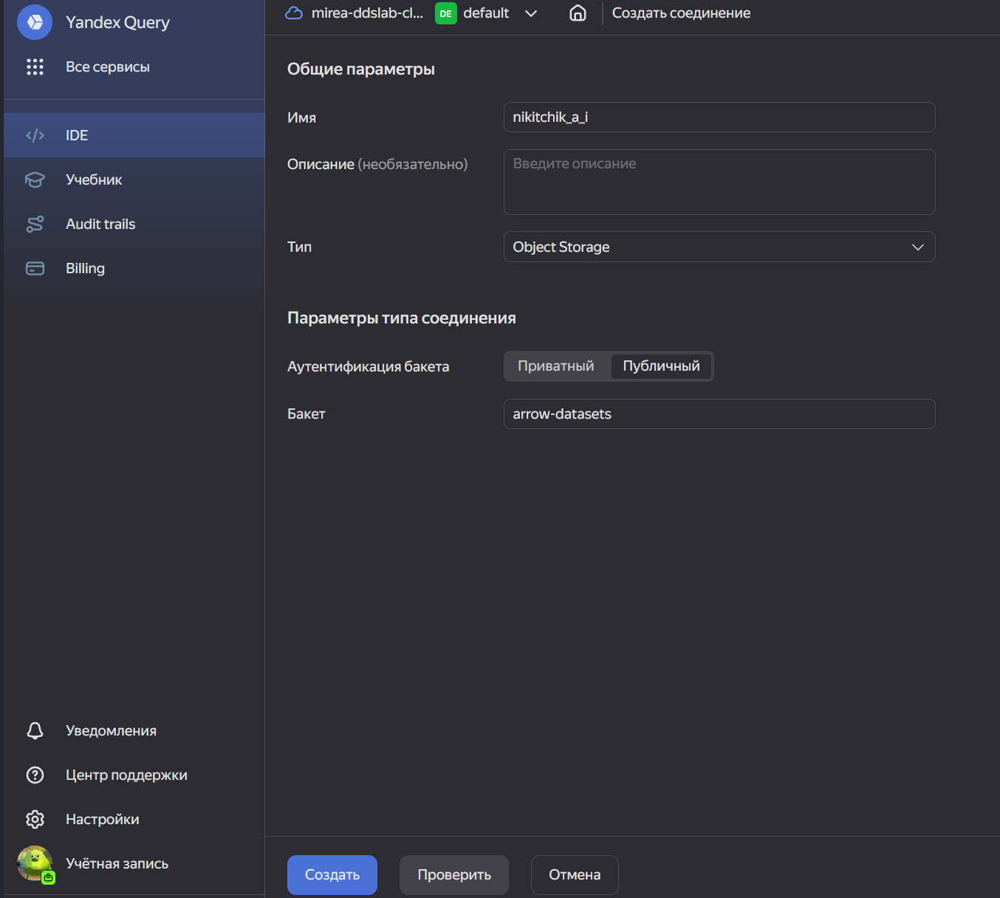
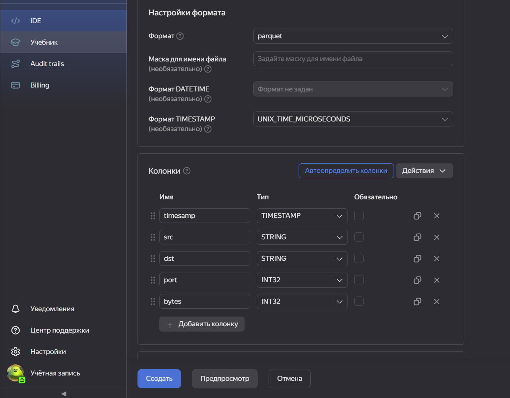
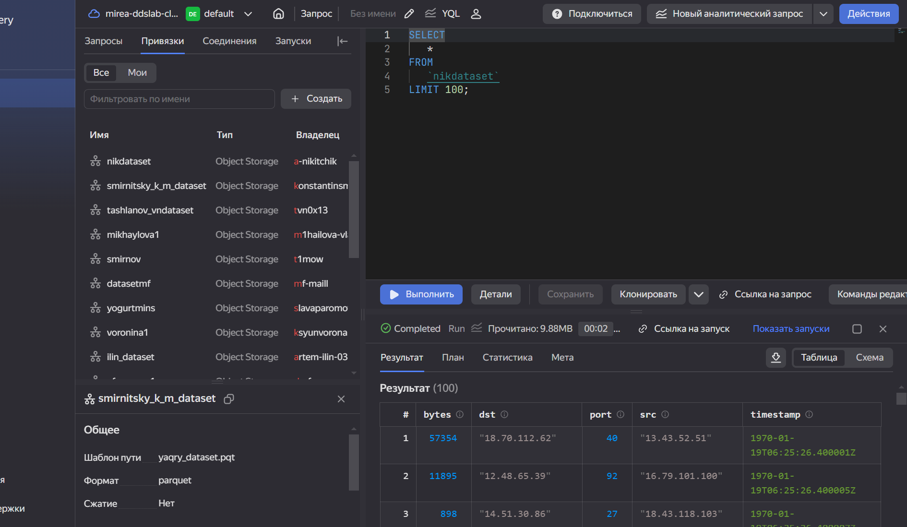
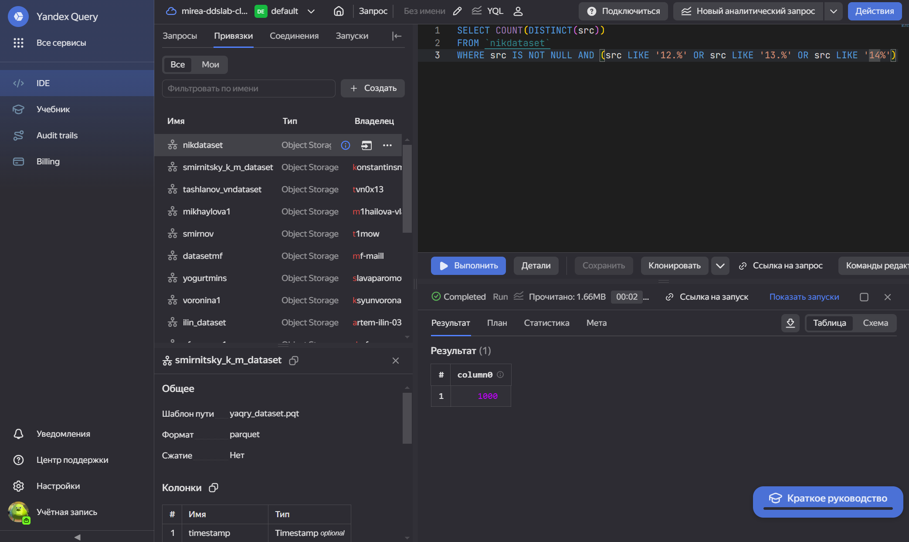
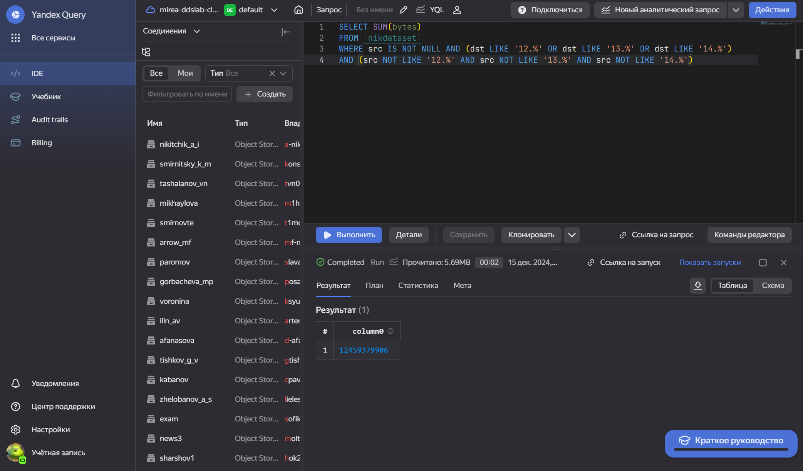

# Технология Yandex Query для анализа данных сетевой активности
a.nikitchik@yandex.ru

## Цель работы

1.  Изучить возможности технологии Yandex Query для анализа
    структурированных наборов данных
2.  Получить навыки построения аналитического пайплайна для анализа
    данных с помощью сервисов Yandex Cloud
3.  Закрепить практические навыки использования SQL для анализа данных
    сетевой активности в сегментированной корпоративной сети

## Исходные данные

1.  Программное обеспечение Windows 11
2.  Rstudio Desktop
3.  Интерпретатор языка R 4.4.2
4.  Бакет arrow-datasets
5.  Аккаунт в Yandex Cloud Organization

## План

1.  Проверить доступность данных в бакете
2.  Подключить бакет как источник данных
3.  Решить задания

## Ход выполнения работы

### 1. Присоединение к организации

### 2. Проверка дотсупности данных с помощью сконструированного URL

### 3. Cоздание собственного соединения по своей фамилии

Заполняем поля с учетом допустимых символов, выбираем тип аутентификации
– публичный. Вводим имя бакета в соответствующее поле и сохраняем.

Теперь, после создания соединения, укажем какой объект использовать в
качестве источника данных. Для этого нужно настроить привязку данных

### 4. Проверка датасета аналитическим запросом

## Анализ и выполнение заданий

### 1. Известно, что IP адреса внутренней сети начинаются с октетов, принадлежащих интервалу 12-14. Определите количество хостов внутренней сети, представленных в датасете.

### 2. Определите суммарный объем исходящего трафика

### 3. Определите суммарный объем входящего трафика

## Оценка результата

Были развиты практические навыки использования технологии Yandex Query
для анализа данных сетевой активности из датасета, получен опыт
использования SQL на платформе Yandex

## Вывод

Платформа Yandex Query является удобным интерактивным бессерверным
инструментом для анализа данных, который позволяет обрабатывать данные
из различных хранилищ, используя SQL-запросы
